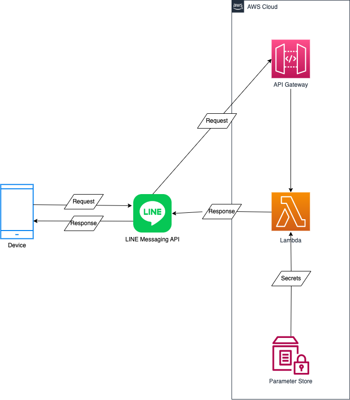

# linebot-yubaba

## 概要

LINEBotで湯婆婆が返答してくれます。

## 構成図



## デプロイ方法

1. [Messaging APIを始めよう \| LINE Developers](https://developers.line.biz/ja/docs/messaging-api/getting-started/)を参考に、LINE Developersコンソールでチャンネルを作成または追加する。  

2. [チャネルアクセストークンを発行する \| LINE Developers](https://developers.line.biz/ja/docs/messaging-api/building-bot/#issue-a-channel-access-token)を参考に、チャンネルアクセストークンを発行

3. AWSコンソールにログインし、以下の設定内容で、AWS Systems Manager Parameter Storeにシークレット情報を各々保存  

|名前|種類|値|
|---|---|---|
|/linebot-yubaba/line-channel-access-token|SecureString|<LINEチャンネルアクセストークン>|
|/linebot-yubaba/line-channel-secret|SecureString|<LINEチャンネルシークレット>|

4. 以下コマンドで、SAMアプリをビルド

``` bash
sam build
```

5. 以下コマンドで、SAMアプリをデプロイ

``` bash
sam deploy --parameter-overrides \
  DefaultKmsId=`aws kms describe-key --key-id alias/aws/ssm --query 'KeyMetadata.KeyId' --output text` \
  LineChannelAccessToken=/linebot-yubaba/line-channel-access-token \
  LineChannelSecret=/linebot-yubaba/line-channel-secret
```

6. [Webhook URLを設定する \| LINE Developers](https://developers.line.biz/ja/docs/messaging-api/building-bot/#setting-webhook-url)を参考に、SAMアプリデプロイ時に出力される"ApiEndpointURL"の値をWebhook URLとして設定

7. [あいさつメッセージを追加する（任意） \| LINE Developers](https://developers.line.biz/ja/docs/messaging-api/building-bot/#set-greeting-message)を参考に、「メッセージ内容：契約書だよ。そこに名前を書きな。」を登録


## 参考文献

[【登壇資料】JAWS\-UG CLI専門支部で「LambdaとLine Messaging APIで湯婆婆botを作ってみた」というLT登壇をしました \| DevelopersIO](https://dev.classmethod.jp/articles/jaws-ug-cli-273-lt/)
