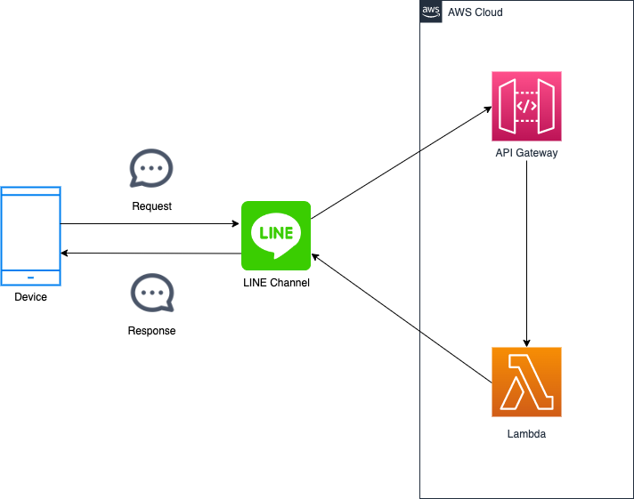

# Linebot-Yubaba

&emsp;
## Overview

This repository contains codes to deploy yubaba line bot.

&emsp;

## Diagram

## Required

- Channel (Line Messaging API)
- AWS CLI
- SAM CLI
- Docker (only if you want to use the container when running sam build)

&emsp;

## Parameters (Line Messaging API)
- Use webhook : Enabled
- Auto-reply messages : Disabled
- Greeting messages : Enabled 
